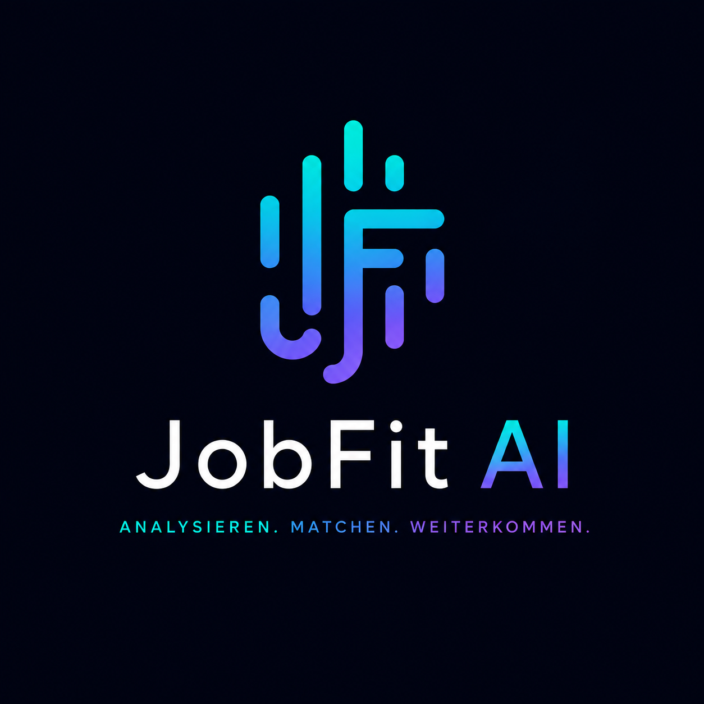

# 🚀 JobFit AI — Smart Job Application Assistant

**JobFit AI** ist eine moderne, webbasierte Anwendung zur automatisierten Analyse von Stellenanzeigen und Generierung maßgeschneiderter Anschreiben mithilfe von KI und n8n-Workflows.

 *(Optional: Screenshot deines UIs)*

---

## ✨ Features

- 🎯 **Match-Analyse:** Vergleicht Anforderungsprofile von Stellenanzeigen direkt mit dem eigenen Lebenslauf/Profil.
- ✍️ **Automatisierte Anschreiben:** Erstellt präzise, auf die Stelle zugeschnittene Bewerbungsschreiben.
- 🔒 **Zero-Data Architecture:** Keine Datenbank-Speicherung. Übermittelte Daten werden flüchtig im n8n-Workflow verarbeitet und umgehend verworfen.
- 🎨 **Dark Glassmorphism UI:** Responsive, moderne Nutzeroberfläche mit Custom Design Tokens und Lucide Icons.
- ⚖️ **Rechtssicher:** Inklusive DSGVO-konformer Datenschutzerklärung & Impressum (§ 5 DDG).

---

## 🛠 Tech Stack

- **Frontend:** HTML5, CSS3 (Custom Variables, Glassmorphism), Vanilla JavaScript
- **Icons & Fonts:** Lucide Icons, *Plus Jakarta Sans* & *JetBrains Mono*
- **Backend / Automation:** Self-hosted n8n (Webhooks & Workflow Engine)
- **Deployment:** GitHub Pages / Netlify

---

## ⚙️ Funktionsweise / Architektur

```text
[ User Input (Formular) ]
          │
          ▼
   (HTTP POST Webhook)
          │
          ▼
    [ n8n Workflow ]  ────►  [ KI / LLM Processing ]
          │                          │
          ▼                          ▼
   (Flüchtige Verarbeitung)   (Match Score & Cover Letter)
          │                          │
          └───────────┬──────────────┘
                      │
                      ▼
        [ Output an Frontend Browser ]
